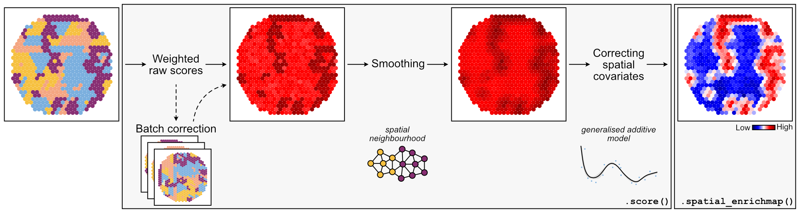

# EnrichMap – Spatially-aware gene set enrichment

<div style="text-align: center;">
  
</div>

`EnrichMap` is a lightweight tool designed to compute and visualise enrichment scores of a given gene set or signature in spatial transcriptomics datasets across different platforms. It offers flexible scoring, batch correction, spatial smoothing and visual outputs for intuitive exploration of biological signatures.



## Features

- Fast computation of enrichment scores
- Support for batch correction and spatial covariates
- Built-in spatial smoothing
- Visualisation tools for intuitive mapping
- Easy integration with AnnData (.h5ad) objects

## Installation

A `conda` environment is strongly recommended with `python` ≥ 3.10.

```bash
conda create -n enrichmap_env python=3.11
conda activate enrichmap_env
```

Then, install `enrichmap` via `pip`.

```bash
pip install enrichmap
```

or directly from GitHub:

```bash
pip install git+https://github.com/yourusername/enrichmap.git
```

## Basic usage

```python
import scanpy as sc
import enrichmap as em

# Load your AnnData object
adata = sc.read_h5ad("PATH/TO/YOUR/DATA.h5ad")

# Define a gene set
gene_set = ["CD3D", "CD3E", "CD8A"]

# Run scoring
em.tl.score(
    adata=adata,
    gene_list=gene_set,
    signature_names="T_cell_signature",
    smoothing=True, # by default,
    correct_spatial_covariates=True, # by default
    batch_key=None # Set batch_key if working with multiple slides
)

# Visualise
em.pl.spatial_enrichmap(
    adata=adata,
    signature_names="T_cell_signature"
)
```

## Documentation

Comprehensive documentation is available at:
https://enrichmap.readthedocs.io/en/latest

## Contributing

If you have ideas for new features or spot a bug, please open an issue or submit a pull request.

## License

This project is licensed under the GNU GENERAL PUBLIC LICENSE.

## Citation

Celik C & Secrier M (2025). EnrichMap: Spatially-aware gene set enrichment for spatial transcriptomics data. [biorxiv.com]()

### Copyright

This code is free and is distributed in the hope that it will be useful, but WITHOUT ANY WARRANTY. See the GNU General Public License for more details.